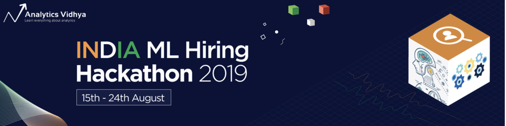
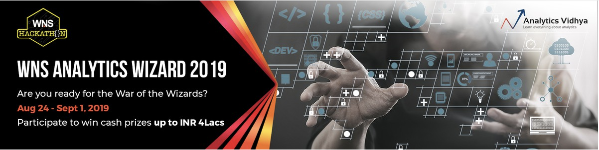
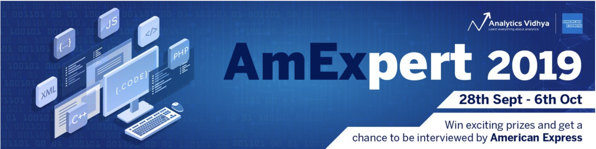
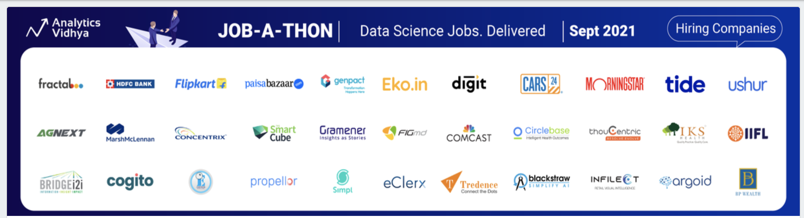

<h1 align="center"> Analytics Vidhya Competitions </h1>

## [LTFS DataScience Finhack an Online Hackathon](https://datahack.analyticsvidhya.com/contest/ltfs-datascience-finhack-an-online-hackathon/)


- Competition details available on [Analytics Vidhya](https://datahack.analyticsvidhya.com/contest/ltfs-datascience-finhack-an-online-hackathon/).
- I have provided a simple approach to start with.  

## [India ML Hiring Hackathon 2019](https://datahack.analyticsvidhya.com/contest/india-ml-hiring-hackathon-2019/)



- I tried different models(Logistic regression, AdaBoost, CatBoost, Xgboost, and LightGB) with hyperparamter optimization and without hyperparameters optimization. <br>
- LightGBM gave the best CV score and best public score 
- [2842_5701.ipynp](https://github.com/dc-aichara/competitions/blob/master/AV/India_ML_Hiring_2019/2842_5701.ipynb) gave public score 0.2842 and private score 0.5701 which is highest among my submissions.<br>
- [3383_5674.ipynb](https://github.com/dc-aichara/competitions/blob/master/AV/India_ML_Hiring_2019/3383_5674.ipynb) gave public score 0.3383 and private score 0.5674 which is second highest among my submissions.<br>
- Notebooks don't include have EDA. <br>
- To learn Bayesioan Optimization technique for Hyperparameters Optimization read my [Medium article](https://medium.com/analytics-vidhya/hyperparameters-optimization-for-lightgbm-catboost-and-xgboost-regressors-using-bayesian-6e7c495947a9). <br>

## [WNS Analytics Wizard 2019](https://datahack.analyticsvidhya.com/contest/wns-analytics-wizard-2019/)



- I tried [Catboost](https://github.com/dc-aichara/competitions/blob/master/AV/WNS/boosting_cgb.ipynb), [LightGBM](https://github.com/dc-aichara/competitions/blob/master/AV/WNS/boosting_lgbm.ipynb) and [XGBoost](https://colab.research.google.com/drive/1bPqOify2F0ETfMLifLApGInRFuZuE4JJ) with [hyperparameters optimization](https://medium.com/analytics-vidhya/hyperparameters-optimization-for-lightgbm-catboost-and-xgboost-regressors-using-bayesian-6e7c495947a9).
- Catboost gives better result for WNS data compare to LightGBM and XGBoost.
- Data preprocessing and feature engineering explained in Notebooks.
- [Ensemble (Catboost + LightGBM ) model](https://github.com/dc-aichara/competitions/blob/master/AV/WNS/boosting_ensemble.ipynb) scored 0.7532 on public data and 0.7455 on private data.

## [AmExpert 2019 – Machine Learning Hackathon](https://datahack.analyticsvidhya.com/contest/amexpert-2019-machine-learning-hackathon/)



- [Solution](https://github.com/dc-aichara/competitions/blob/master/AV/AmEx_2019/AmEx.ipynb)

## [LTFS DataScience Finhack-2 an Online Hackathon](https://datahack.analyticsvidhya.com/contest/ltfs-data-science-finhack-2-an-online-hackathon/)


- [Solution with CatBoost](https://github.com/dc-aichara/competitions/tree/master/AV/LTFS-II)


## [JOB-A-THON - September 2021](https://datahack.analyticsvidhya.com/contest/job-a-thon-september-2021/)

 

* [Solution](https://github.com/dc-aichara/competitions/tree/master/AV/av_jobathon_sept2021) has an end to end pipeline for quick experimentation with feature generation, model training, and model serving. Pipeline is a configuration based pipeline. Configuration helps to control features and training parameters with more ease. If you want to start using end to end pipeline for competitions, refer [this](https://github.com/dc-aichara/competition_template) ready to consume template. 
* I have used streaming prediction approach with LightGBM for time series predictions.
* I only build a generalized model. But score could be improved by adding more lag features and building individual store models. 
* Run whole pipeline with on command. `sh start_pipeline.sh`

## Disclaimer

```text
I don't own copyrights to data provided here. All the data are provided just for reference and educational purpose only. 

```
